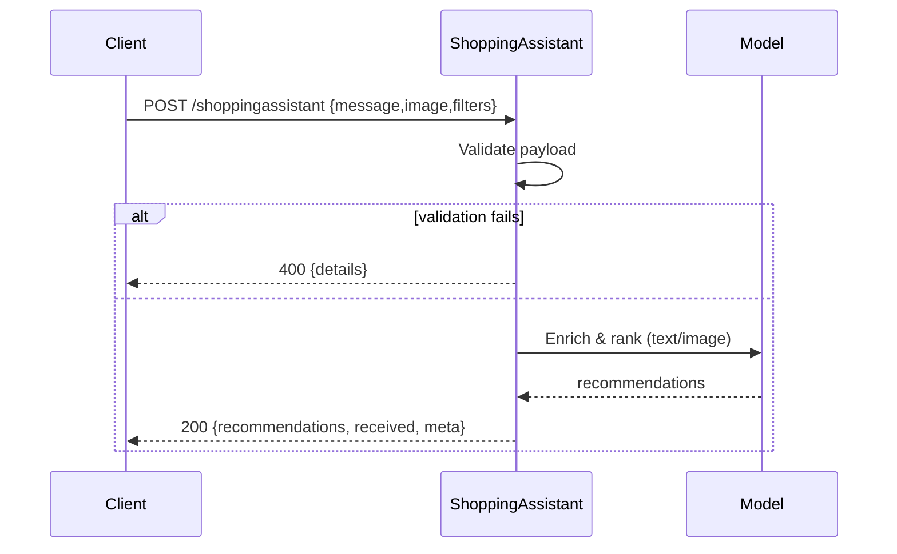

# Shopping Assistant — Product Requirements Document (PRD)

## Overview

This PRD describes the `shoppingassistant` microservice used in the demo harness. The service accepts a short user message and an optional image, and returns shopping recommendations and a normalized `received` payload. The PRD supplements the OpenAPI spec at `demo/test_demo/openapi/shoppingassistant.yaml` with business intent, detailed field definitions, non-functional requirements, telemetry, privacy considerations, and a test matrix intended for automated validation and drift detection.

## Stakeholders

 - Product: Shopping UX
 - Engineering: demo/test_demo service owner
 - QA: validation & drift testing
 - Data Science: ranking & personalization
 - Security & Privacy

## Goals

- Return consistent, deterministic response shapes for the same logical input.
- Reject invalid inputs with a structured 4xx error payload.
- Support both text- and image-driven recommendations.
 - Return consistent, deterministic response shapes for the same logical input.
 - Reject invalid inputs with a structured 4xx error payload.
 - Support both text- and image-driven recommendations.
 - Provide clear telemetry and versioning to trace model- and logic-driven behavior changes.

## Endpoints

### POST /shoppingassistant

- Purpose: Accept a user prompt (and optional image) and return recommendations.
- Authentication: None for demo (internal only).
 - Purpose: Accept a user prompt (and optional image) and return recommendations.
 - Authentication: None for demo (internal only). Production deployment MUST enforce authentication and rate limiting.

Request JSON

```json
{
  "message": "string, required (1..1000 chars)",
  "image": "string | null, optional (URL or base64)",
  "user_id": "string | null, optional (uuid)",
  "session_id": "string | null, optional",
  "filters": {"category":"string|null","price_max":number|null}
}
```

Field constraints

- `message`: required, min_length=1, max_length=1000
- `image`: optional, when present must be a valid URL or a base64-encoded image (max payload contribution 1MB)
- `user_id`: optional, if present should be a UUID
 - `image`: optional, when present must be a valid URL or a base64-encoded image (max payload contribution 1MB)
 - `user_id`: optional, if present should be a UUID
 - `filters`: optional object (category, price_max)

Success response (HTTP 200)

```json
{
  "recommendations": [
    {"id":"string","title":"string","price":number,"image_url":"string|null","score":0.0}
  ],
  "received": {"message":"...","image":null|"...","user_id":null|"...","session_id":null|"...","filters":{...}},
  "meta": {"mode":"text"|"image","confidence":0.0,"model_version":"v1.0.0"},
  "timestamp": "ISO-8601"
}
```

Error response (HTTP 400 — validation_failed)

```json
{
  "error": "validation_failed",
  "details": [
    {"field":"message","error":"missing_required","expected":"string"}
  ]
}
```

Error response (HTTP 500 — server_error)

```json
{
  "error": "server_error",
  "message": "Human-readable description",
  "incident_id": "string (uuid)"
}
```

## Business Rules

- If `image` is present, the service should prioritize image-based recommendations and set `meta.mode = "image"`.
- If `image` is absent, use NLP on `message` and set `meta.mode = "text"`.
- Always include `received` fields; if a value is absent use `null` explicitly to avoid behavioral drift.
 - If `image` is present, the service should prioritize image-based recommendations and set `meta.mode = "image"`.
 - If `image` is absent, use NLP on `message` and set `meta.mode = "text"`.
 - Always include `received` fields; if a value is absent use `null` explicitly to avoid behavioral drift.
 - Always return `meta.model_version` so consumers and tests can trace behavioral differences.

## Non-functional requirements

- 95th percentile latency &lt; 500ms (demo best-effort)
- Responses must be consistent in schema across success and error cases
 - 95th percentile latency < 500ms (text-only; demo best-effort)
 - Image-enabled requests target <1200ms 95th percentile
 - Responses must be consistent in schema across success and error cases

## Acceptance criteria

1. A valid request returns HTTP 200 with `recommendations`, `received`, `meta`, and `timestamp`.
2. Missing `message` returns HTTP 400 with `error=validation_failed` and `details[].expected` set.
3. `received.image` is present in every response (value or `null`).
4. `meta.model_version` present and matches the deployed model.

## Examples

- Valid request

 - Valid request

 ```json
 { "message": "Find me summer dresses", "image": null }
 ```

- Invalid request (missing message)

 - Invalid request (missing message)

 ```json
 { "image": "https://example.com/pic.jpg" }
 ```

## Data model (canonical)

- RecommendationItem
  - `id`: string
  - `title`: string
  - `price`: number
  - `image_url`: string|null
  - `score`: number (0..1)

- RequestEnvelope
  - `message`: string
  - `image`: string|null
  - `user_id`: string|null
  - `session_id`: string|null
  - `filters`: object|null

## Observability & telemetry

- Emit metrics: `shoppingassistant_requests_total`, `shoppingassistant_request_duration_seconds`, `shoppingassistant_validation_errors_total`.
- Include `model_version` as metric label and in response `meta`.
- Structured logs must include: `timestamp`, `request_id`, `endpoint`, `status`, `latency_ms`, `user_id`, `model_version`.

## Privacy & security notes

- Treat images as sensitive PII: do not log raw image contents; log only hashes or references.
- Demo is unauthenticated; production MUST enable authentication and rate limiting.

## Testing matrix (suggested automated tests)

- Valid cases: text-only, image-only, text+image, filters.
- Invalid cases: missing `message`, `image` wrong type, `filters.price_max` string.
- Boundary cases: `message` length = 1 and = 1000.

## Sequence diagram



## Mapping to repo

- OpenAPI spec: `demo/test_demo/openapi/shoppingassistant.yaml`
- Demo service: `demo/test_demo/test_services.py`
- Runner + PRD-driven tests: `demo/test_demo/run_prd_validation.py`

## Notes for testers

- When writing tests or generating invalid cases, assert `details[].expected`, explicit `null` fields in `received`, presence of `meta.model_version`, and `recommendations[].score` within `[0,1]`.

## Mapping to repo

- OpenAPI spec: `demo/test_demo/openapi/shoppingassistant.yaml`
- Demo service: `demo/test_demo/test_services.py`
- Demo acceptance tests: `demo/test_demo/tests/` (examples live in this repo)

## Notes for testers

- When writing tests or generating invalid cases, include checks for `details[].expected` and explicit `null` fields in `received`.
